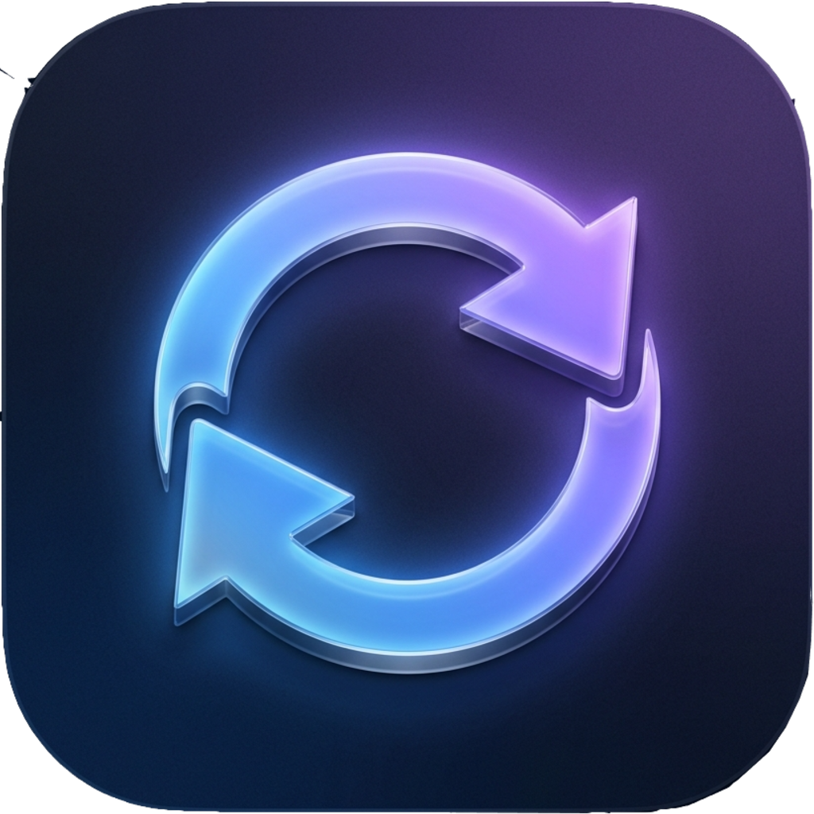
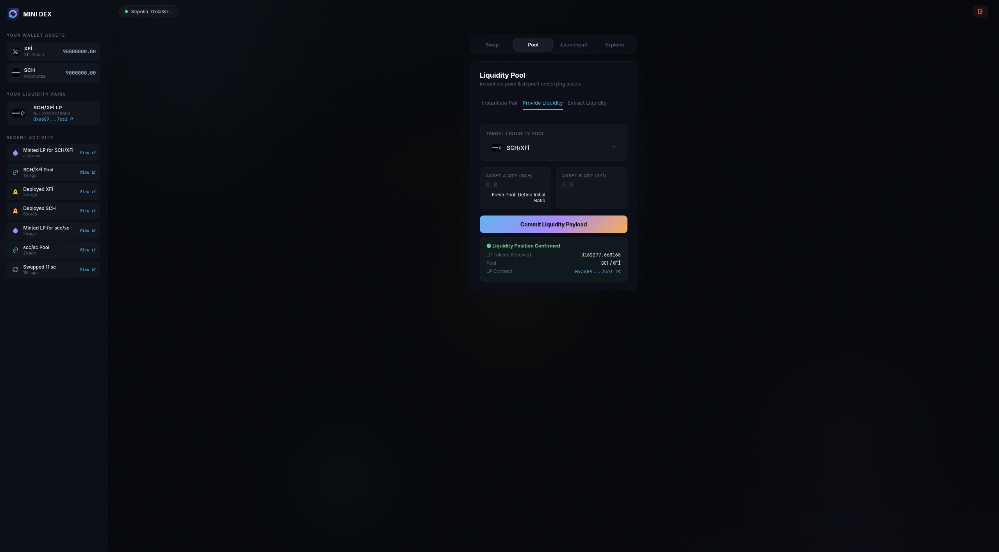

# Mini-DEX Protocol

<p align="center">
  
</p>


A routerless Automated Market Maker (AMM) and permissionless token Launchpad, built from scratch using Foundry and Ethers.js v6. Developed as part of a self-directed study into DeFi primitives, constant product mathematics, and LP mechanics.

**Live Demo:** [0xschutze.github.io/web3-lab/contracts/03_mini-dex-protocol/frontend](https://0xschutze.github.io/web3-lab/contracts/03_mini-dex-protocol/frontend)

<p align="center">
  
</p>

---

## Security Disclaimer

> [!WARNING]
> **This code is NOT intended for production use.**
> This protocol is a laboratory experiment built to understand the internal mechanics of platforms like Uniswap V2 at a granular level.
>
> - **Unaudited:** The codebase has not been reviewed by an external security firm.
> - **Known Risks:** Specific attack vectors (e.g. Initial Liquidity Inflation) have been mitigated, however the protocol may still be susceptible to MEV, front-running, or edge-case arithmetic issues.
> - **Financial Risk:** Interacting with this protocol on mainnet will likely result in loss of funds.

---

## Codebase Navigation

- [**`/src`**](./src) — Core smart contracts (`MiniDexFactory`, `MiniDexPair`, `Launchpad`)
- [**`/test`**](./test) — Foundry integration tests and invariant checks
- [**`/script`**](./script) — Deployment scripts for testnet/mainnet
- [**`/frontend`**](./frontend) — Custom Vanilla JS Web3 interface

---

## Protocol Architecture

### 1. Routerless AMM (`Mini-DEX-Pair`)
- Implements the constant product invariant: $X \cdot Y = K$.
- Charges a hardcoded 0.5% exchange fee, accrued directly to reserve balances.
- Mints initial LP shares using a geometric mean (Babylonian square root) to prevent inflation attacks.
- Decouples internal reserve tracking from raw ERC20 transfers via an explicit `sync()` mechanism.

### 2. Factory (`Mini-DEX-Factory`)
- Permissionless liquidity pair deployment via `CREATE`.
- Sorts token addresses canonically (`token0 < token1`) to prevent duplicate pair creation.

### 3. Launchpad (`Launchpad` & `Token`)
- Proxy deployer for standard ERC20 token instantiation.
- Enforces a hard cap of 1 Trillion tokens. Flash-minting and re-basing mechanisms are excluded by design.

---

## Frontend

The protocol includes a single-page web interface for interacting with all three components on Sepolia.

**Stack:** Vanilla JavaScript (ES6+), HTML5, CSS3, Ethers.js v6, Supabase (off-chain indexer), RemixIcon.

**Key features:**
- Token deployment, pair creation, liquidity provisioning and removal, and token swapping.
- Supabase is used as an off-chain indexer to cache deployed tokens, pairs, and transaction history — reducing unnecessary RPC calls.
- Wallet auto-reconnect on page load via `eth_accounts` (no pop-up on revisit).
- Duplicate token name/symbol validation before deployment.
- Image crop modal for token logos.
- Real-time price impact indicator and pool share estimate on swap and liquidity forms.

---

## Testnet Deployments (Sepolia)

| Contract | Address |
|---|---|
| Launchpad | [`0xf09fd17a452fd0044a41f198d6af9523e90dc078`](https://sepolia.etherscan.io/address/0xf09fd17a452fd0044a41f198d6af9523e90dc078) |
| MiniDEX Factory | [`0x0ddbde777dcaf54e7cf075f7f9a0aa89fc9ae60e`](https://sepolia.etherscan.io/address/0x0ddbde777dcaf54e7cf075f7f9a0aa89fc9ae60e) |

---

## Database Security Note (Supabase)

> [!WARNING]
> In this lab setup, the frontend writes directly to Supabase using the public `anon` key. This is intentional for simplicity in a testnet environment.
>
> **In a production context**, Row Level Security (RLS) must be enabled on all tables. The `anon` key should be restricted to read-only (`SELECT`) access. Write operations should only be performed by a trusted off-chain indexer (e.g. an Alchemy Webhook listener or Node.js event watcher) using the `service_role` key — never exposed to the client.

---

## Local Development

### Contracts (Foundry)

**Prerequisites:** [Foundry](https://getfoundry.sh/) installed.

```shell
git clone https://github.com/0xSchutze/web3-lab.git
cd web3-lab/contracts/mini-dex-protocol
forge install
forge build
```

**Run tests:**
```shell
forge test --match-contract MiniDexTest -vv
```

### Frontend (Local)

No build step required. The frontend is plain HTML/JS and can be served with any static file server.

```shell
# Using Python (built-in)
cd web3-lab/contracts/mini-dex-protocol/frontend
python3 -m http.server 8080

# Using Node.js (npx)
npx serve .
```

Then open `http://localhost:8080` in your browser. Make sure MetaMask is installed and connected to the **Sepolia** testnet.

> The Supabase indexer and Alchemy RPC keys are included in `js/config.js` for convenience in this educational context. Do not reuse these keys in a production environment.

---

*Part of the [web3-lab](https://github.com/0xSchutze/web3-lab) repository — a self-directed study project by 0xSchutze. 🤍*
